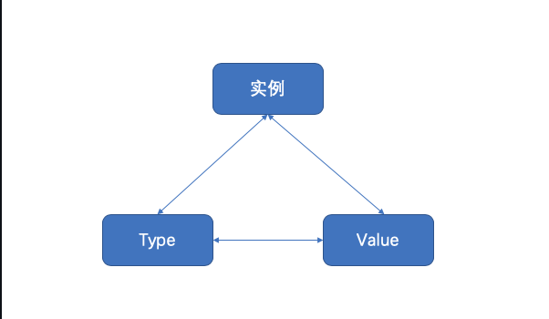

## 一、反射 reflect

### 1、反射介绍

**Go 语言提供了一种机制在运行时更新变量和检查它们的值、调用它们的方法，但是在编译时并不知道这些变量的具体类型，这称为反射机制。**

为什么要用反射

需要反射的 2 个常见场景：

1. 有时你需要编写一个函数，但是并不知道传给你的参数类型是什么，可能是没约定好；也可能是传入的类型很多，这些类型并不能统一表示。这时反射就会用的上了。
2. 有时候需要根据某些条件决定调用哪个函数，比如根据用户的输入来决定。这时就需要对函数和函数的参数进行反射，在运行期间动态地执行函数。

但是对于反射，还是有几点不太建议使用反射的理由：

1. 与反射相关的代码，经常是难以阅读的。在软件工程中，代码可读性也是一个非常重要的指标。
2. Go 语言作为一门静态语言，编码过程中，编译器能提前发现一些类型错误，但是对于反射代码是无能为力的。所以包含反射相关的代码，很可能会运行很久，才会出错，这时候经常是直接 panic，可能会造成严重的后果。
3. 反射对性能影响还是比较大的，比正常代码运行速度慢一到两个数量级。所以，对于一个项目中处于运行效率关键位置的代码，**尽量避免使用反射特性**。

### 2、Type 和 Value

我们一般用到的包是 reflect 包。

```go
// ValueOf用来获取输入参数接口中的数据的值，如果接口为空则返回0
func ValueOf(i interface{}) Value {...}

// TypeOf用来动态获取输入参数接口中的值的类型，如果接口为空则返回nil
func TypeOf(i interface{}) Type {...}
```

示例代码：

```go
package main

import (
    "fmt"
    "reflect"
)

func main() {
    //反射操作：通过反射，可以获取一个接口类型变量的 类型和数值
    var x float64 =3.4

    fmt.Println("type:",reflect.TypeOf(x)) //type: float64
    fmt.Println("value:",reflect.ValueOf(x)) //value: 3.4

    fmt.Println("-------------------")
    //根据反射的值，来获取对应的类型和数值
    v := reflect.ValueOf(x)
    fmt.Println("kind is float64: ",v.Kind() == reflect.Float64)
    fmt.Println("type : ",v.Type())
    fmt.Println("value : ",v.Float())
}
```

说明

1. reflect.TypeOf： 直接给到了我们想要的 type 类型，如 float64、int、各种 pointer、struct 等等真实的类型
2. reflect.ValueOf：直接给到了我们想要的具体的值，如 1.2345 这个具体数值，或者类似&{1 "Allen.Wu" 25} 这样的结构体 struct 的值
3. 也就是说明反射可以将“接口类型变量”转换为“反射类型对象”，反射类型指的是 reflect.Type 和 reflect.Value 这两种

Type 和 Value 都包含了大量的方法，其中第一个有用的方法应该是 Kind，这个方法返回该类型的具体信息：Uint、Float64 等。Value 类型还包含了一系列类型方法，比如 Int()，用于返回对应的值。以下是 Kind 的种类：

```go
type Kind uint
const (
    Invalid Kind = iota
    Bool
    Int
    Int8
    Int16
    Int32
    Int64
    Uint
    Uint8
    Uint16
    Uint32
    Uint64
    Uintptr
    Float32
    Float64
    Complex64
    Complex128
    Array
    Chan
    Func
    Interface
    Map
    Ptr
    Slice
    String
    Struct
    UnsafePointer
)
```

## 二、reflect 对象获取接口变量信息

### 1、反射的规则

其实反射的操作步骤非常的简单，就是通过实体对象获取反射对象(Value、Type)，然后操作相应的方法即可。

下图描述了实例、Value、Type 三者之间的转换关系：



反射 API 的分类总结如下：

**1) 从实例到 Value**

通过实例获取 Value 对象，直接使用 reflect.ValueOf() 函数。例如：

```go
func ValueOf(i interface {}) Value
```

**2) 从实例到 Type**

通过实例获取反射对象的 Type，直接使用 reflect.TypeOf() 函数。例如：

```go
func TypeOf(i interface{}) Type
```

**3) 从 Type 到 Value**

Type 里面只有类型信息，所以直接从一个 Type 接口变量里面是无法获得实例的 Value 的，但可以通过该 Type 构建一个新实例的 Value。reflect 包提供了两种方法，示例如下：

```go
//New 返回的是一个 Value，该 Value 的 type 为 PtrTo(typ)，即 Value 的 Type 是指定 typ 的指针类型
func New(typ Type) Value
//Zero 返回的是一个 typ 类型的零佳，注意返回的 Value 不能寻址，位不可改变
func Zero(typ Type) Value
```

如果知道一个类型值的底层存放地址，则还有一个函数是可以依据 type 和该地址值恢复出 Value 的。例如：

```go
func NewAt(typ Type, p unsafe.Pointer) Value
```

**4) 从 Value 到 Type**

从反射对象 Value 到 Type 可以直接调用 Value 的方法，因为 Value 内部存放着到 Type 类型的指针。例如：

```go
func (v Value) Type() Type
```

**5) 从 Value 到实例**

Value 本身就包含类型和值信息，reflect 提供了丰富的方法来实现从 Value 到实例的转换。例如：

```go
//该方法最通用，用来将 Value 转换为空接口，该空接口内部存放具体类型实例
//可以使用接口类型查询去还原为具体的类型
func (v Value) Interface() （i interface{})

//Value 自身也提供丰富的方法，直接将 Value 转换为简单类型实例，如果类型不匹配，则直接引起 panic
func (v Value) Bool () bool
func (v Value) Float() float64
func (v Value) Int() int64
func (v Value) Uint() uint64
```

**6) 从 Value 的指针到值**

从一个指针类型的 Value 获得值类型 Value 有两种方法，示例如下。

```go
//如果 v 类型是接口，则 Elem() 返回接口绑定的实例的 Value，如采 v 类型是指针，则返回指针值的 Value，否则引起 panic
func (v Value) Elem() Value
//如果 v 是指针，则返回指针值的 Value，否则返回 v 自身，该函数不会引起 panic
func Indirect(v Value) Value
```

**7) Type 指针和值的相互转换**

指针类型 Type 到值类型 Type。例如：

```go
//t 必须是 Array、Chan、Map、Ptr、Slice，否则会引起 panic
//Elem 返回的是其内部元素的 Type
t.Elem() Type
```

值类型 Type 到指针类型 Type。例如：

```go
//PtrTo 返回的是指向 t 的指针型 Type
func PtrTo(t Type) Type
```

**8) Value 值的可修改性**

Value 值的修改涉及如下两个方法：

```go
//通过 CanSet 判断是否能修改
func (v Value ) CanSet() bool
//通过 Set 进行修改
func (v Value ) Set(x Value)
```

Value 值在什么情况下可以修改？我们知道实例对象传递给接口的是一个完全的值拷贝，如果调用反射的方法 reflect.ValueOf() 传进去的是一个值类型变量， 则获得的 Value 实际上是原对象的一个副本，这个 Value 是无论如何也不能被修改的。

**根据 Go 官方关于反射的博客，反射有三大定律：**

> 第一条是最基本的：反射可以从接口值得到反射对象。
>
> 反射是一种检测存储在 interface 中的类型和值机制。这可以通过 TypeOf 函数和 ValueOf 函数得到。

> 第二条实际上和第一条是相反的机制，反射可以从反射对象获得接口值。
>
> 它将 ValueOf 的返回值通过 Interface()函数反向转变成 interface 变量。
>
> 前两条就是说 接口型变量和 反射类型对象可以相互转化，反射类型对象实际上就是指的前面说的 reflect.Type 和 reflect.Value。

> 第三条不太好懂：如果需要操作一个反射变量，则其值必须可以修改。
>
> 反射变量可设置的本质是它存储了原变量本身，这样对反射变量的操作，就会反映到原变量本身；反之，如果反射变量不能代表原变量，那么操作了反射变量，不会对原变量产生任何影响，这会给使用者带来疑惑。所以第二种情况在语言层面是不被允许的。

### 2、反射的使用

> 1、已知原有类型

已知类型后转换为其对应的类型的做法如下，直接通过 Interface 方法然后强制转换，如下：

```go
realValue := value.Interface().(已知的类型)
```

示例代码：

```go
package main

import (
    "fmt"
    "reflect"
)

func main() {
    var num float64 = 1.2345

    pointer := reflect.ValueOf(&num)
    value := reflect.ValueOf(num)

    // 可以理解为“强制转换”，但是需要注意的时候，转换的时候，如果转换的类型不完全符合，则直接panic
    // Golang 对类型要求非常严格，类型一定要完全符合
    // 如下两个，一个是*float64，一个是float64，如果弄混，则会panic
    convertPointer := pointer.Interface().(*float64)
    convertValue := value.Interface().(float64)

    fmt.Println(convertPointer)
    fmt.Println(convertValue)
}
```

说明

1. 转换的时候，如果转换的类型不完全符合，则直接 panic，类型要求非常严格！
2. 转换的时候，要区分是指针还是指
3. 也就是说反射可以将“反射类型对象”再重新转换为“接口类型变量”

> 2、未知原有类型

很多情况下，我们可能并不知道其具体类型，那么这个时候，该如何做呢？需要我们进行遍历探测其 Filed 来得知，示例如下:

```go
package main

import (
    "fmt"
    "reflect"
)

type Person struct {
    Name string
    Age int
    Sex string
}

func (p Person)Say(msg string)  {
    fmt.Println("hello，",msg)
}
func (p Person)PrintInfo()  {
    fmt.Printf("姓名：%s,年龄：%d，性别：%s\n",p.Name,p.Age,p.Sex)
}

func main() {
    p1 := Person{"王二狗",30,"男"}

    DoFiledAndMethod(p1)

}

// 通过接口来获取任意参数
func DoFiledAndMethod(input interface{}) {

    getType := reflect.TypeOf(input) //先获取input的类型
    fmt.Println("get Type is :", getType.Name()) // Person
    fmt.Println("get Kind is : ", getType.Kind()) // struct

    getValue := reflect.ValueOf(input)
    fmt.Println("get all Fields is:", getValue) //{王二狗 30 男}

    // 获取方法字段
    // 1. 先获取interface的reflect.Type，然后通过NumField进行遍历
    // 2. 再通过reflect.Type的Field获取其Field
    // 3. 最后通过Field的Interface()得到对应的value
    for i := 0; i < getType.NumField(); i++ {
        field := getType.Field(i)
        value := getValue.Field(i).Interface() //获取第i个值
        fmt.Printf("字段名称:%s, 字段类型:%s, 字段数值:%v \n", field.Name, field.Type, value)
    }

    // 通过反射，操作方法
    // 1. 先获取interface的reflect.Type，然后通过.NumMethod进行遍历
    // 2. 再公国reflect.Type的Method获取其Method
    for i := 0; i < getType.NumMethod(); i++ {
        method := getType.Method(i)
        fmt.Printf("方法名称:%s, 方法类型:%v \n", method.Name, method.Type)
    }
}
```

说明

> 通过运行结果可以得知获取未知类型的 interface 的具体变量及其类型的步骤为：
>
> 1. 先获取 interface 的 reflect.Type，然后通过 NumField 进行遍历
> 2. 再通过 reflect.Type 的 Field 获取其 Field
> 3. 最后通过 Field 的 Interface()得到对应的 value

> 通过运行结果可以得知获取未知类型的 interface 的所属方法（函数）的步骤为：
>
> 1. 先获取 interface 的 reflect.Type，然后通过 NumMethod 进行遍历
> 2. 再分别通过 reflect.Type 的 Method 获取对应的真实的方法（函数）
> 3. 最后对结果取其 Name 和 Type 得知具体的方法名
> 4. 也就是说反射可以将“反射类型对象”再重新转换为“接口类型变量”
> 5. struct 或者 struct 的嵌套都是一样的判断处理方式

# 三、通过 reflect.Value 设置实际变量的值

> reflect.Value 是通过 reflect.ValueOf(X)获得的，只有当 X 是指针的时候，才可以通过 reflec.Value 修改实际变量 X 的值，即：要修改反射类型的对象就一定要保证其值是“addressable”的。
>
> 也就是说：要想修改一个变量的值，那么必须通过该变量的指针地址 , 取消指针的引用 。通过 refPtrVal := reflect.Valueof( &var )的方式获取指针类型，你使用 refPtrVal.elem( ).set（一个新的 reflect.Value）来进行更改，传递给 set()的值也必须是一个 reflect.value。

这里需要一个方法：

`func (Value)Elem`

如果你的变量是一个指针、map、slice、channel、Array。那么你可以使用 reflect.Typeof(v).Elem()来确定包含的类型。

```go
package main

import (
    "fmt"
    "reflect"
)

func main() {

    var num float64 = 1.2345
    fmt.Println("num的数值:", num)

    //需要操作指针
    //通过reflect.ValueOf获取num中的reflect.Value，注意，参数必须是指针才能修改其值
    pointer := reflect.ValueOf(&num)
    newValue := pointer.Elem()

    fmt.Println("类型 :", newValue.Type()) //float64
    fmt.Println("是否可以修改:", newValue.CanSet())

    // 重新赋值
    newValue.SetFloat(77)
    fmt.Println("新的数值:", num)

    ////////////////////

    // 如果reflect.ValueOf的参数不是指针，会如何？

    //尝试直接修改
    //value := reflect.ValueOf(num)
    //value.SetFloat(6.28) //panic: reflect: reflect.Value.SetFloat using unaddressable value
    //fmt.Println(value.CanSet()) //false

    //pointer = reflect.ValueOf(num)
    //newValue = value.Elem() // 如果非指针，这里直接panic，“panic: reflect: call of reflect.Value.Elem on float64 Value”
}
```

运行结果：

```go
num的数值: 1.2345
类型 : float64
是否可以修改: true
新的数值: 77
```

说明

1. 需要传入的参数是\* float64 这个指针，然后可以通过 pointer.Elem()去获取所指向的 Value，**注意一定要是指针**。
2. 如果传入的参数不是指针，而是变量，那么
   - 通过 Elem 获取原始值对应的对象则直接 panic
   - 通过 CanSet 方法查询是否可以设置返回 false
3. newValue.CantSet()表示是否可以重新设置其值，如果输出的是 true 则可修改，否则不能修改，修改完之后再进行打印发现真的已经修改了。
4. reflect.Value.Elem() 表示获取原始值对应的反射对象，只有原始对象才能修改，当前反射对象是不能修改的
5. 也就是说如果要修改反射类型对象，其值必须是“addressable”【对应的要传入的是指针，同时要通过 Elem 方法获取原始值对应的反射对象】
6. struct 或者 struct 的嵌套都是一样的判断处理方式

尝试修改结构体中的字段数值：

```go
package main

import (
    "reflect"
    "fmt"
)

type Student struct {
    Name string
    Age int
    School string
}
func main()  {
    /*
    通过反射，来更改对象的数值：前提是数据可以被更改
     */
    s1:=Student{"王二狗",19,"千锋教育"}
    fmt.Printf("%T\n",s1) //main.Student
    p1:=&s1
    fmt.Printf("%T\n",p1) //*main.Student
    fmt.Println(s1.Name)
    fmt.Println((*p1).Name,p1.Name)

    v1:= reflect.ValueOf(&s1) // value

    if v1.Kind()==reflect.Ptr{
        fmt.Println(v1.Elem().CanSet())
        v1 = v1.Elem()
    }

    f1:=v1.FieldByName("Name")
    f1.SetString("韩茹")
    f3:=v1.FieldByName("School")
    f3.SetString("幼儿园")
    fmt.Println(s1)

}
```

运行结果：

```go
main.Student
*main.Student
王二狗
王二狗 王二狗
true
{韩茹 19 幼儿园}
```

# 四、通过 reflect.Value 来进行方法的调用

这算是一个高级用法了，前面我们只说到对类型、变量的几种反射的用法，包括如何获取其值、其类型、以及如何重新设置新值。但是在项目应用中，另外一个常用并且属于高级的用法，就是通过 reflect 来进行方法【函数】的调用。比如我们要做框架工程的时候，需要可以随意扩展方法，或者说用户可以自定义方法，那么我们通过什么手段来扩展让用户能够自定义呢？关键点在于用户的自定义方法是未可知的，因此我们可以通过 reflect 来搞定。

Call()方法：

`func (Value)Call`

通过反射，调用方法。

先获取结构体对象，然后

示例代码：

```go
package main

import (
    "fmt"
    "reflect"
)

type Person struct {
    Name string
    Age int
    Sex string
}

func (p Person)Say(msg string)  {
    fmt.Println("hello，",msg)
}
func (p Person)PrintInfo()  {
    fmt.Printf("姓名：%s,年龄：%d，性别：%s\n",p.Name,p.Age,p.Sex)
}

func (p Person) Test(i,j int,s string){
    fmt.Println(i,j,s)
}

// 如何通过反射来进行方法的调用？
// 本来可以用结构体对象.方法名称()直接调用的，
// 但是如果要通过反射，
// 那么首先要将方法注册，也就是MethodByName，然后通过反射调动mv.Call

func main() {
    p2 := Person{"Ruby",30,"男"}
    // 1. 要通过反射来调用起对应的方法，必须要先通过reflect.ValueOf(interface)来获取到reflect.Value，
    // 得到“反射类型对象”后才能做下一步处理
    getValue := reflect.ValueOf(p2)

    // 2.一定要指定参数为正确的方法名
    // 先看看没有参数的调用方法

    methodValue1 := getValue.MethodByName("PrintInfo")
    fmt.Printf("Kind : %s, Type : %s\n",methodValue1.Kind(),methodValue1.Type())
    methodValue1.Call(nil) //没有参数，直接写nil

    args1 := make([]reflect.Value, 0) //或者创建一个空的切片也可以
    methodValue1.Call(args1)

    // 有参数的方法调用
    methodValue2 := getValue.MethodByName("Say")
    fmt.Printf("Kind : %s, Type : %s\n",methodValue2.Kind(),methodValue2.Type())
    args2 := []reflect.Value{reflect.ValueOf("反射机制")}
    methodValue2.Call(args2)

    methodValue3 := getValue.MethodByName("Test")
    fmt.Printf("Kind : %s, Type : %s\n",methodValue3.Kind(),methodValue3.Type())
    args3 := []reflect.Value{reflect.ValueOf(100), reflect.ValueOf(200),reflect.ValueOf("Hello")}

    methodValue3.Call(args3)
}
```

运行结果：

```go
Kind : func, Type : func()
姓名：Ruby,年龄：30，性别：男
姓名：Ruby,年龄：30，性别：男
Kind : func, Type : func(string)
hello， 反射机制
Kind : func, Type : func(int, int, string)
100 200 Hello
```

通过反射，调用函数。

首先我们要先确认一点，函数像普通的变量一样，之前的章节中我们在讲到函数的本质的时候，是可以把函数作为一种变量类型的，而且是引用类型。如果说 Fun()是一个函数，那么 f1 := Fun 也是可以的，那么 f1 也是一个函数，如果直接调用 f1()，那么运行的就是 Fun()函数。

那么我们就先通过 ValueOf()来获取函数的反射对象，可以判断它的 Kind，是一个 func，那么就可以执行 Call()进行函数的调用。

示例代码：

```go
package main

import (
    "fmt"
    "reflect"
)

func main() {
    //函数的反射
    f1 := fun1
    value := reflect.ValueOf(f1)
    fmt.Printf("Kind : %s , Type : %s\n",value.Kind(),value.Type()) //Kind : func , Type : func()

    value2 := reflect.ValueOf(fun2)
    fmt.Printf("Kind : %s , Type : %s\n",value2.Kind(),value2.Type()) //Kind : func , Type : func(int, string)

    //通过反射调用函数
    value.Call(nil)

    value2.Call([]reflect.Value{reflect.ValueOf(100),reflect.ValueOf("hello")})

}

func fun1(){
    fmt.Println("我是函数fun1()，无参的。。")
}

func fun2(i int, s string){
    fmt.Println("我是函数fun2()，有参数。。",i,s)
}
```

说明

1. 要通过反射来调用起对应的方法，必须要先通过 reflect.ValueOf(interface)来获取到 reflect.Value，得到“反射类型对象”后才能做下一步处理
2. reflect.Value.MethodByName 这个 MethodByName，需要指定准确真实的方法名字，如果错误将直接 panic，MethodByName 返回一个函数值对应的 reflect.Value 方法的名字。
3. []reflect.Value，这个是最终需要调用的方法的参数，可以没有或者一个或者多个，根据实际参数来定。
4. reflect.Value 的 Call 这个方法，这个方法将最终调用真实的方法，参数务必保持一致，如果 reflect.Value.Kind 不是一个方法，那么将直接 panic。
5. 本来可以用对象访问方法直接调用的，但是如果要通过反射，那么首先要将方法注册，也就是 MethodByName，然后通过反射调用 methodValue.Call
