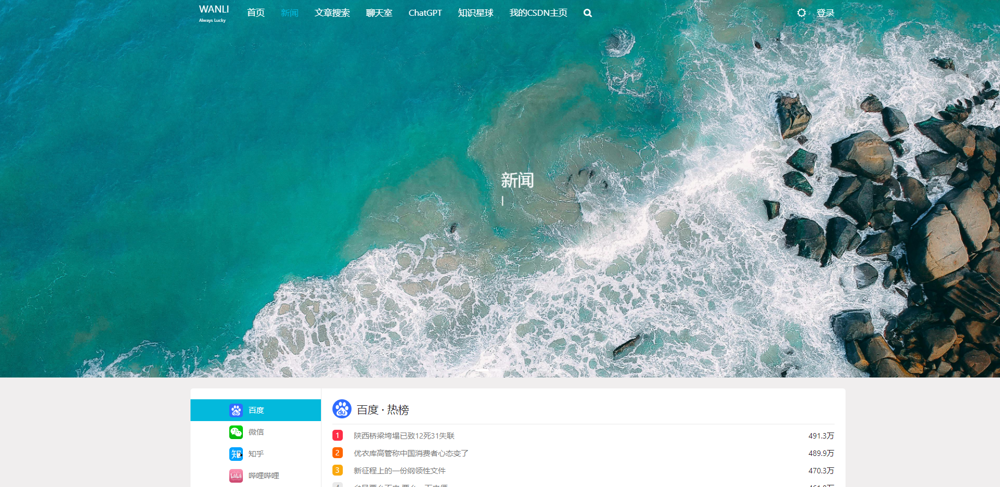
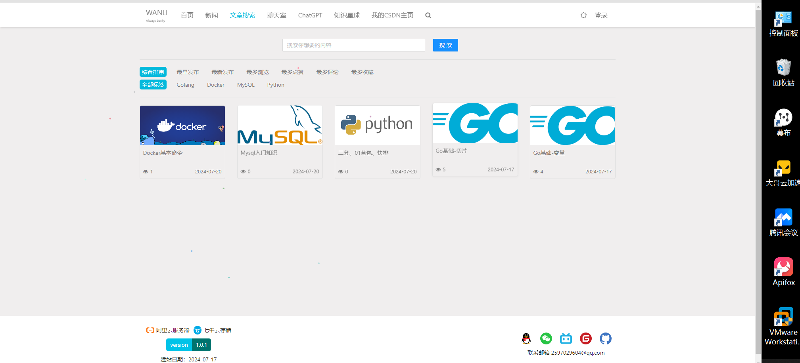
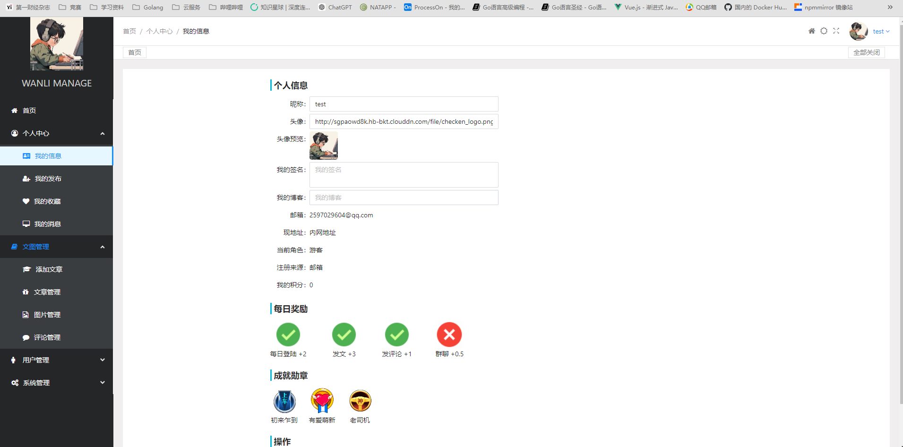

# WANLI 博客系统

## 项目介绍

基于 vue3 和 gin 框架开发的前后端分离个人博客系统，包含 md 格式的文本编辑展示，点赞评论收藏，新闻热点，匿名聊天室，文章搜索等功能。

---

## 功能展示








---

## 技术介绍

#### 开发环境

| 开发工具     | 功能描述       |
| ------------ | -------------- |
| GoLand       | 后端开发       |
| Vscode       | 前端开发       |
| Apifox       | API 测试       |
| Ubuntu       | 依赖软件运行   |
| xftp、xsheel | Linux 远程工具 |

| 开发环境                  | 版本    |
| ------------------------- | ------- |
| GoLang                    | 1.22.3  |
| nodejs                    | 20.14.0 |
| MySQL                     | 8.0     |
| Elasticsearch、kibana、ik | 7.10.1  |
| Redis                     | latest  |

---

#### 技术栈

> 这里只写一些主流的通用技术，详细第三方库：前端参考 package.json 文件，后端参考 go.mod 文件

| 功能描述     | 前端           | 官方地址                                      |
| ------------ | -------------- | --------------------------------------------- |
| Vue3 框架    | vuejs          | https://cn.vuejs.org/                         |
| Vue 组件     | ant-design-vue | https://next.antdv.com/docs/vue/introduce-cn/ |
| Mark Down    | md-editor-v3   | https://imzbf.github.io/md-editor-v3/         |
| 状态管理工具 | pinia          | https://pinia.vuejs.org/                      |
| 构建工具     | vite           | https://cn.vitejs.dev/                        |
| 可视化图表库 | echarts        | https://echarts.apache.org/zh/index.html      |

| 功能描述 | 后端   | 官方地址                           |
| -------- | ------ | ---------------------------------- |
| GO 语言  | golang | https://github.com/golang/go       |
| WEB 框架 | gin    | https://gin-gonic.com/zh-cn/docs/  |
| API 文档 | swaggo | https://github.com/swaggo          |
| ORM 库   | gorm   | https://github.com/go-gorm/gorm    |
| 日志库   | logrus | https://github.com/sirupsen/logrus |

---

## 本地运行

> 自行安装 Golang、Node、MySQL、Redis 、Elasticsearch 环境
> Golang 安装参考官方文档
> Node 建议安装使用 `https://nodejs.org/zh-cn` 的长期维护版
> MySQL、Redis、Elasticsearch 建议使用 Docker 运行

后端项目运行：

```powershell
# 1、启动MySQL、Redis、Elasticsearch,其中mysql需要新建一个库
# 2、修改项目运行的配置文件 settings.yaml

# 3、初始化运行环境
go mod tidy 				# 下载当前项目所依赖的包
go run main.go -db 			# mysql建表
go run main.go -es create	# elasticsearch建索引

# 4、mysql插入菜单表数据
INSERT INTO gvb.menu_models (id, created_at, updated_at, title, path, slogan, abstract, abstract_time, banner_time, sort) VALUES (1, NOW(), NOW(), '首页', '/', '众神眷恋的幻想乡', '天寒地冻路远马亡又何妨', 5, 5, 1);
INSERT INTO gvb.menu_models (id, created_at, updated_at, title, path, slogan, abstract, abstract_time, banner_time, sort) VALUES (2, NOW(), NOW(), '新闻', '/news', '新闻三分钟，知晓天下事', '震惊!男人看了会沉默，女人看了会流泪!不转不是中国人!',  5, 5, 2);
INSERT INTO gvb.menu_models (id, created_at, updated_at, title, path, slogan, abstract, abstract_time, banner_time, sort) VALUES (3, NOW(), NOW(), '文章搜索', '/search', '文章搜索', '文章搜索',  5, 5, 3);
INSERT INTO gvb.menu_models (id, created_at, updated_at, title, path, slogan, abstract, abstract_time, banner_time, sort) VALUES (4, NOW(), NOW(),'聊天室', '/chat_group', '聊天室', '聊天室',  5, 5, 4);

# 5、创建第一个用户，后续可在前端创建或注册
go run main.go -u admin		# 管理员
go run main.go -u user		# 普通用户

# 6、启动项目
go run main.go
```

前端项目运行：

```powershell
# 下载当前项目所依赖的包
npm i
# 启动项目
npm run dev
```

---

## 线上部署（Linux）| 待完善
