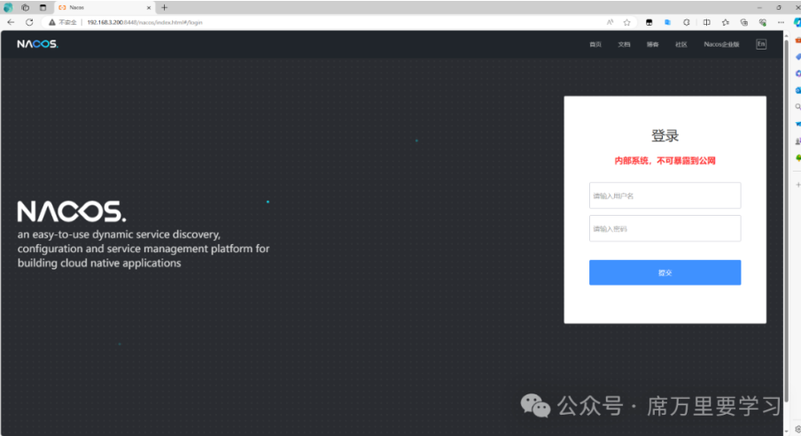
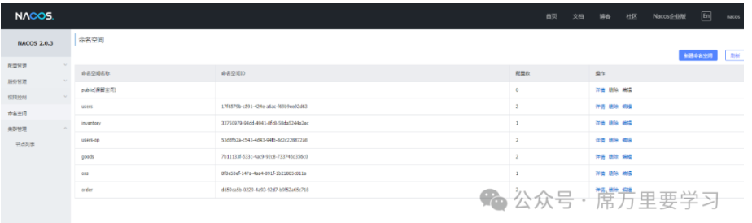
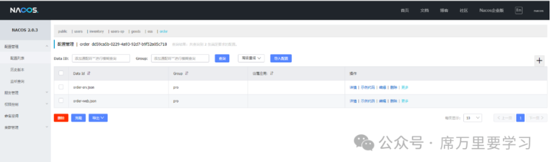
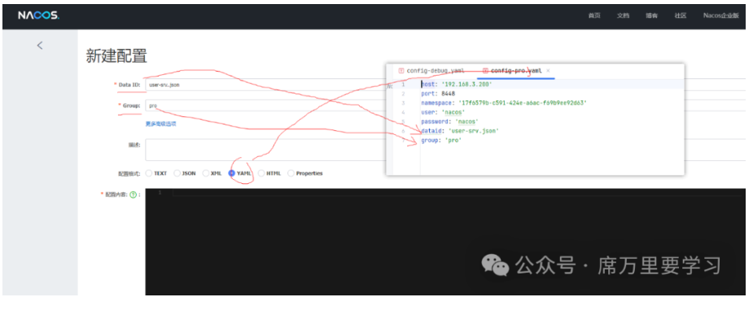
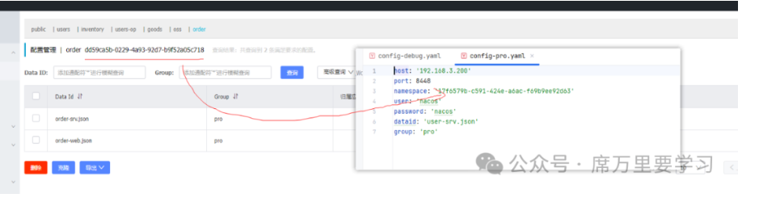

原创 席万里 席万里要学习 2024 年 06 月 07 日 13:07

主要给大家讲一下怎么将配置文件的信息导入到 nacos 中去。

登录密码和账号都是 nacos，直接登录就可以了。



1、我们登录进去之后可以看到左侧有命名空间的字样，我们就在右上角去创建新的命名空间，如下：



2、然后我们找到上面的配置管理->配置列表，我们可以看到主页面上面已经有了我们的各个命名空间，然后我们点击最右边的+号，添加信息：



3、在后端我们使用了 yaml 文件，在 nacos 配置的时候一些信息要映射正确：





内容就是我们要配置的信息了，所有的配置信息如下（你自己配置就可了，不懂的话私信我）：

注：以下所有的 Group 我都使用 pro 了，如果要使用 dev 的话 自己克隆改一下就可以了。

1、用户服务

user-srv.json

```
{
    "name":"user-srv",
    "mysql":{
        "host":"127.0.0.1", #修改为你的IP地址
        "port":3306,
        "db":"mxshop_user_srv",
        "user":"root",
        "password":"xiwanli"
    },
    "consul":{
        "host":"192.168.3.200",
        "port":8500
    }
}
```

user-web.json

```
{
    "name":"user-web",
    "host":"192.168.3.152",
    "port":8024,
    "user_srv":{
        "host":"192.168.3.152",
        "port":50051,
        "name":"user-srv"
    },
    "jwt":{
        "key":"asdfasdfFDSF4r32#04#"
    },
    "sms":{# 短信服务 阿里云的自己操作一下，暂时也可以不用操作（不对程序有大影响）
        "key":"",
        "secrect":""
    },
    "consul":{
        "host":"192.168.3.200",
        "port":8500
    },
    "redis":{
        "host":"192.168.3.200",
        "port":6379,
        "expire":300
    }
}
```

2、库存服务

inventory-srv.json

```
{
    "name":"inventory-srv",
    "tags":["inventory-srv","xiwanli"],
    "host":"192.168.3.152",
    "mysql":{
        "host":"127.0.0.1",
        "port":3306,
        "db":"mxshop_inventory_srv",
        "user":"root",
        "password":"xiwanli"
    },
    "consul":{
        "host":"192.168.3.200",
        "port":8500
    }
}
```

3、用户操作服务

userop-srv.json

```
{
    "name":"userop-srv",
    "tags":["userop-srv","xiwanli"],
    "host":"192.168.3.152",
    "mysql":{
        "host":"127.0.0.1",
        "port":3306,
        "db":"mxshop_userop_srv",
        "user":"root",
        "password":"xiwanli"
    },
    "consul":{
        "host":"192.168.3.200",
        "port":8500
    }
}
```

userop-web.json

```
{
    "name":"userop-web",
    "host":"192.168.3.152",
    "port":8025,
    "tags":["userop-web","xiwanli"],
    "userop_srv":{
        "name":"userop-srv"
    },
    "goods_srv":{
        "name":"goods-srv"
    },
    "jwt":{
        "key":"asdfasdfFDSF4r32#04#"
    },
    "consul":{
        "host":"192.168.3.200",
        "port":8500
    }
}
```

4、商品服务

goods-srv.json

```
{
    "name":"goods-srv",
    "tags":["goods-srv","xiwanli"],
    "host":"192.168.3.152",
    "mysql":{
        "host":"127.0.0.1",
        "port":3306,
        "db":"mxshop_goods_srv",
        "user":"root",
        "password":"xiwanli"
    },
    "consul":{
        "host":"192.168.3.200",
        "port":8500
    },
    "es":{
        "host":"192.168.3.200",
        "port":9200
    }
}
```

goods-web.json

```
{
    "name":"goods-web",
    "host":"192.168.3.152",
    "port":8021,
    "tags":["goods-web","xiwanli"],
    "goods_srv":{
        "name":"goods-srv"
    },
    "inventory_srv":{
        "name":"inventory-srv"
    },
    "jwt":{
        "key":"asdfasdfFDSF4r32#04#"
    },
    "consul":{
        "host":"192.168.3.200",
        "port":8500
    },
    "jaeger":{
        "host":"192.168.3.200",
        "port":6831,
        "name":"mxshop"
    }
}
```

5、oss 服务

oss-web.json

```
{
    "name":"oss-web",
    "host":"192.168.3.152",
    "port":8023,
    "tags":["oss-web","xiwanli"],
    "jwt":{
        "key":"asdfasdfFDSF4r32#04#"
    },
    "consul":{
        "host":"192.168.3.200",
        "port":8500
    },
    "oss":{
        "key":"",
        "secrect":"",
        "host":"http://mxx-shop.oss-cn-beijing.aliyuncs.com",
        "callback_url":"http://vuau2r.natappfree.cc/oss/v1/oss/callback",
        "upload_dir":""
    }
}
```

6、库存服务

order-srv.json

```
{
    "name":"order-srv",
    "tags":["order-srv","xiwanli"],
    "host":"192.168.3.152",
    "mysql":{
        "host":"127.0.0.1",
        "port":3306,
        "db":"mxshop_order_srv",
        "user":"root",
        "password":"xiwanli"
    },
    "consul":{
        "host":"192.168.3.200",
        "port":8500
    },
    "goods_srv":{
        "name":"goods-srv"
    },
    "inventory_srv":{
        "name":"inventory-srv"
    }
}
```

order-web.json

```
{
    "name":"order-web",
    "host":"192.168.3.152",
    "port":8022,
    "tags":["order-web","xiwanli"],
    "order_srv":{
        "name":"order-srv"
    },
    "goods_srv":{
        "name":"goods-srv"
    },
    "inventory_srv":{
        "name":"inventory-srv"
    },
    "jwt":{
        "key":"asdfasdfFDSF4r32#04#"
    },
    "consul":{
        "host":"192.168.3.200",
        "port":8500
    },
    "alipay":{ # 自己修改一下
        "app_id":"90210d010135640880",
        "private_key":"MIIEpQIBAAKCAQEAptrdcXYZq6whaQSwjePqOIsI4kX2WVXr9BYaZw6no1v/6t6J4W1K0+OgqPiyxWPl5kImUu+fukCgd20sI20vgXdi7hDeZMEfe1UMTlHrrLg5i0IXYLCC2IdWScYcM4UdOCtQlvJSEpg/GX1n4dIOZ4RsRCmw62Rsy+B3clh6NbhiLtg+HO8C9qiNukceK9L4Q6JH3c6HiJWnA8dyQ1uHwG9jvZmU+YTbj0FiETPtCDkZYfetjLGpB9vcJgm0aJtPcHdtHoJdwchznGmZ2lrBgHMt6wpr221vHE+tXhoI5hj4NRl+K0vnRl3TUVXxRvM18ULPfUSsstR4QQqpgU+Nw8QIDAQABAoIBAQCcOG36Ys/YHoniWyEbM/vAL3gnQB5xCiW79rogqASIyEJFjKiDWHx4T2a9r7qcQ3e+DBJlnFGQRv8tQqOYLwJy22k18ZhLy/6mTZcXfb6T8IQ0GBy9tCLSqtPh10AH7Gr1WIu8dJF9qWdh/yrQbCa2zFC4IX03qG+gPtU4+IISgQTPwZvjD9qk8ZA5n7d9eUzMYrdztStBz+Mmi/PjFWlilxfggIowU7qUVhXxN1WKWW+nV5sdGWXU16Rl/paGOVjL0sLPlECHrup++2vMdfyyq4a7gG0yl2gIEkWQJapR+6YWXI3Uc1PYlvLfrzD5/PpYOz7bWUBNycdWwUpW/RUBAoGBAN3sGVhrOMp+pnxdLb+oMgZqJR4PrAZ9fPu6pDT3oQD5Nm0ii4OqbfNjYhTZ/7hdsTVjPI83uBDpStXlp9NOr+392gWdkvcbFru+/uuEIWyjcKrDw62tn7aZMZ+7oiz4UdHn6QfvwG+J+WgVVHkX4cGoUbVxugPj88jpWtHJ+5olAoGBAMB6B+QH9Ezu9VkXw3GYCsNgp7W3neGRYeb3VzjlsKCqnB+jaBH1Ex+nTXBrhHzuzRoFwj41OltQ1lnwVWmJPPeEBTO3fV1A7lRJJ/LofwaHiffRayzt5iQ9mlqHEs4Kht3Fpyg7Zpt6T+sfGqBVKKg2Rzt335aH0+DQKbPz8jPdAoGBANSkAbUjKAt/R28qqUdXlndnBaHESoT9gOCDegv2qqMQKAJyc1P53di0haqNJ+Y0gDQznjdsoEY0A6zonOJwJ0rXTizLS6LSpfnHjOOGe7Bo+u/lHH4yOzLvnwj69O46EcwbdsJQDAfUINKGfaZ6J6sz6Pb+vco0hcchMhCKhTaxAoGATkrVHtplc03YGu9hnrk715FfZrlTzUc3zZ1aq1gy6oe7jdsIIBXSO5PwGgSCFdeFMkqZYniATlipeFgcRht+4yeefhTrN52L1FkVmOcdlGhZpKZYtCPo82DjgmNjMNBzX45gmirfZ+ruyzMRv5okOZgqjXQLTM3fT5kc/YgDQzkCgYEAxcpIpcoa29ga9dJqbw/HToEWwfG2mJGWWhQrB9ySRa0QxgFoOZzDln1KCN/ck/7iEW9f2vEfxjluzbPQmPodsJrEWrs/hP3iQDoZUvWt8RIqcC5h1JxpoA5FOkBUEI/xbAt/ypPmP1gbNl01IUPONYDEYx0UzPqh6j15tEKM02o=",
        "ali_public_key":"MIIBIjANBgkqhkiG9w0BAQEFAAOCAQa8AMIIBCgKCAQEApb5zaEYrOgB9s8gX7yNGbF86nF8BvUjT0f01no0I2HDNvXjuQrYdmiHz8xfxCdysvUeTR4SURru6LYus3e8JB+l2TdmWPzrPjcdefxV5PSpIR6A/6xGkeKOxacKbYSMvt3t98Ge4GAovAatV5hM6t77UhmlC1jWmwCkEeD2t21kLbxl70v2I8ztsqlbH1jzEPeyHF02p11kYPjJ+Vte4M+vMbX4fDxBjABUBCVMRURRDXCcbD+lzRMTyoGiDxdU4MXJGYS/HBaQgrEsK1GoTkuv/2XB0jfdHmIa89cJvMvGle5WNlTfn4T6+2PbsrvS0XJYhcTIY0pv8wwkf6hCMHwIDAQAB",
        "notify_url":"http://echmjv.natappfree.cc/o/v1/pay/alipay/notify",
        "return_url":"http://192.168.3.152:8022/"
    },
    "jaeger":{
        "host":"192.168.3.200",
        "port":6831,
        "name":"mxshop"
    }
}
```

到这里就结束了，感谢大家的观看。
