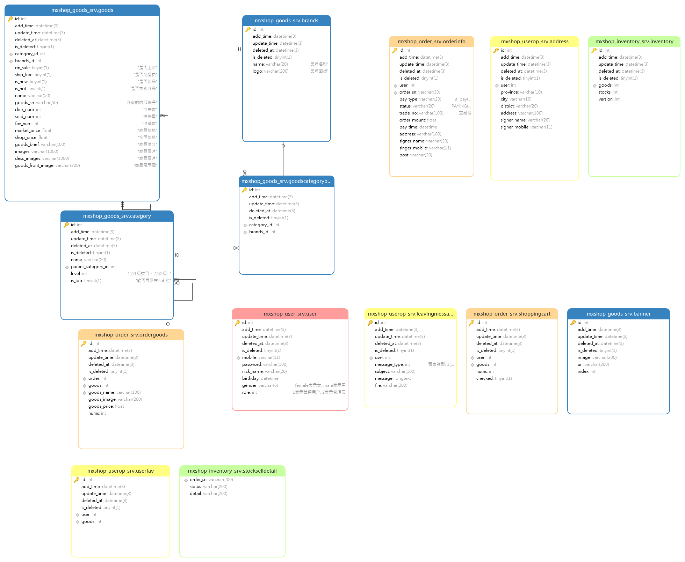

# yg 校园易购

适合于学习微服务架构的实战项目，采用微服务架构的方式来写这个系统的相关功能，包括用户服务、商品服务、库存服务等等。


## 一、技术栈简介

采用微服务架构的方式来写这个系统的相关功能，包括用户服务、商品服务、库存服务等等。

- Golang 1.22.3
- Gin
- Mysql 8.0
- Redis
- Nodejs 14.21.3（建议使用 14.21.3 下载，并且使用淘宝镜像）
- Vue
- gRPC
- Consul
- Nacos

点击跳转 Git：[GIthub 地址](https://github.com/xzhHas/yg)

## 二、快速开始

> 安装本系统使用到的插件，这里推荐使用 docker 安装，此操作皆在 ubuntu 系统下操作，如果是其他系统只需要修改一下命令即可。

1、docker 安装 Mysql8.0

2、docker 安装 Redis

3、docker 安装 Nacos

4、docker 安装 Consul

5、docker 安装：Elasticsearch、kibana 及 ik 的安装

**搭建系统详解网址：** [CSDN 网站搭建前的准备教程](https://blog.csdn.net/m0_73337964/article/details/139523540)

### 1、前端的配置

采用 vue 搭建一套后台管理系统和一套电商系统。

1、获取 vue 所需要的依赖：

```
npm insatll
```

2、启动 vue 项目：

```
npm run dev
```

### 2、后端的配置

1、protobuf 的配置

我已经把文件复制到 docs/protobuf 文件下了，把他们直接复制到你的 go 安装目录的 bing 文件夹下即可。

然后在每一个文件目录下的 proto 文件下，在终端输入(生成所需要的 proto 文件)：

```
protoc --go_out=. --go-grpc_out=. *.proto
```

2、修改`config-pro.yaml`文件里面的信息为 nacos 的模式即可。

3、最后，在每一个还有 main.go 的目录下进行终端启动：

```
go mod tidy
go build
./xxx.exe
```

注：这里我是打算写一个脚本一键启动的，但是还没完成，后续会修改的。

### 3、启动

此时，前端和后端都已经启动了，就可以点开浏览器去测试一下了。

http://xxxxxxxx:8089

http://xxxxxx:8090

## 三、数据库设计



## 四、核心系统功能

1 用户功能

2 用户操作功能

3 库存服务

4 商品服务

5 订单服务

## 五、效果演示

[前台商城系统&后端管理系统](https://github.com/xzhHas/yg)

## 六、可能出现的问题

1、在使用 oss 服务的时候可能出现服务未发现的问题，这是因为 oos 的回调服务必须是公网 IP，如果你用的本地计算机，那么就需要内网穿透解决。

2、在使用阿里云支付的回调服务同上，也许哟啊内网穿透。

3、使用 ubuntu 系统，在本地可能无法访问虚拟机的 IP 地址或者连接不上，请修改虚拟机为桥接模式。

4、前端在 npm insatll 的时候报错，请看错误信息，出现错误的极大概率就是本地的微软运行库不全，那你自己在网上找一个修复一下就可了。

## 七、最后

感谢大家观看我的内容。
